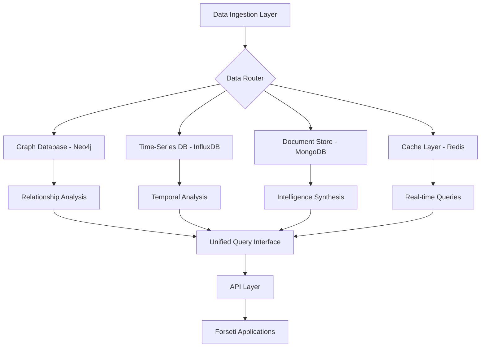

# PROJECT DATABASE INTEGRATION DOCUMENTATION
**CLASSIFICATION**: Internal Development Use Only

---

## OVERVIEW

This document provides comprehensive technical specifications for the database integration architecture within Project Forseti. The system employs a hybrid database approach combining graph databases for relationship modeling, time-series databases for temporal analysis, and document stores for intelligence artifacts.

---

## DATABASE ARCHITECTURE

### PRIMARY STORAGE SYSTEMS

| **Database Type** | **Technology** | **Use Case** | **Scaling** |
|-------------------|----------------|--------------|-------------|
| **Graph Database** | Neo4j / NetworkX | Entity relationships, network topology | Horizontal |
| **Time-Series DB** | InfluxDB | Financial data, personnel movements | Vertical |
| **Document Store** | MongoDB | Intelligence reports, analysis artifacts | Horizontal |
| **Cache Layer** | Redis | API responses, session data | Memory-based |
| **Search Engine** | Elasticsearch | Full-text search, semantic analysis | Horizontal |

### DATA FLOW ARCHITECTURE



---

## GRAPH DATABASE SPECIFICATIONS

### ENTITY SCHEMA

```python
# Core Entity Types
ENTITY_TYPES = {
    "PERSON": {
        "properties": ["full_name", "aliases", "birth_date", "nationality"],
        "security_clearance": "string",
        "influence_score": "float",
        "threat_classification": "enum"
    },
    "CORPORATION": {
        "properties": ["legal_name", "registration_number", "headquarters"],
        "market_cap": "float",
        "industry_classification": "string",
        "threat_level": "enum"
    },
    "GOVERNMENT_ENTITY": {
        "properties": ["agency_name", "jurisdiction", "authority_level"],
        "classification_level": "enum",
        "operational_scope": "string"
    },
    "FINANCIAL_INSTRUMENT": {
        "properties": ["instrument_type", "value", "currency"],
        "risk_rating": "string",
        "liquidity_score": "float"
    }
}

# Relationship Types
RELATIONSHIP_TYPES = {
    "EMPLOYMENT": {
        "properties": ["position", "start_date", "end_date", "salary_range"],
        "relationship_strength": "float",
        "confidence_score": "float"
    },
    "OWNERSHIP": {
        "properties": ["ownership_percentage", "acquisition_date", "control_type"],
        "voting_rights": "boolean",
        "beneficial_ownership": "boolean"
    },
    "FINANCIAL_FLOW": {
        "properties": ["amount", "transaction_date", "flow_type", "purpose"],
        "suspicious_activity_score": "float",
        "compliance_status": "enum"
    },
    "POLICY_INFLUENCE": {
        "properties": ["influence_type", "policy_area", "effectiveness_score"],
        "lobbying_expenditure": "float",
        "outcome_correlation": "float"
    }
}
```

### GRAPH QUERIES

```cypher
-- High-influence entity identification
MATCH (p:PERSON)-[r:EMPLOYMENT]->(c:CORPORATION)
WHERE p.influence_score > 8.0 AND c.threat_level = 'HIGH'
RETURN p.full_name, c.legal_name, r.position, r.relationship_strength
ORDER BY p.influence_score DESC

-- Second-order relationship discovery
MATCH (a:CORPORATION)-[r1]-(intermediate)-[r2]-(b:CORPORATION)
WHERE a.legal_name = 'OpenAI' AND b.legal_name = 'Palantir'
AND r1.confidence_score > 0.8 AND r2.confidence_score > 0.8
RETURN DISTINCT intermediate, r1, r2

-- Financial flow analysis
MATCH (source)-[f:FINANCIAL_FLOW]->(target)
WHERE f.amount > 1000000 AND f.transaction_date > date('2024-01-01')
AND f.suspicious_activity_score > 0.7
RETURN source.legal_name, target.legal_name, f.amount, f.purpose
ORDER BY f.amount DESC
```

---

## TIME-SERIES DATABASE SPECIFICATIONS

### MEASUREMENT SCHEMAS

```python
# Financial metrics measurement
FINANCIAL_METRICS = {
    "measurement": "financial_data",
    "tags": {
        "entity_id": "string",
        "instrument_type": "string",
        "currency": "string",
        "exchange": "string"
    },
    "fields": {
        "price": "float",
        "volume": "float",
        "market_cap": "float",
        "volatility": "float",
        "sentiment_score": "float"
    },
    "time": "timestamp"
}

# Personnel movement tracking
PERSONNEL_MOVEMENTS = {
    "measurement": "personnel_events",
    "tags": {
        "person_id": "string",
        "organization_from": "string",
        "organization_to": "string",
        "movement_type": "string"
    },
    "fields": {
        "influence_change": "float",
        "security_clearance_level": "string",
        "position_level": "integer",
        "compensation_change": "float"
    },
    "time": "timestamp"
}

# Policy events measurement
POLICY_EVENTS = {
    "measurement": "policy_changes",
    "tags": {
        "policy_area": "string",
        "jurisdiction": "string",
        "implementing_agency": "string",
        "policy_type": "string"
    },
    "fields": {
        "impact_score": "float",
        "affected_entities_count": "integer",
        "lobbying_correlation": "float",
        "implementation_speed": "float"
    },
    "time": "timestamp"
}
```

### TIME-SERIES QUERIES

```sql
-- Financial volatility analysis
SELECT 
    MEAN(volatility) as avg_volatility,
    MAX(volatility) as max_volatility,
    entity_id
FROM financial_data 
WHERE time >= now() - 30d 
GROUP BY time(1d), entity_id
ORDER BY time DESC

-- Personnel movement trends
SELECT 
    COUNT(*) as movement_count,
    MEAN(influence_change) as avg_influence_change
FROM personnel_events 
WHERE time >= now() - 90d
GROUP BY time(7d), organization_to
ORDER BY time DESC

-- Policy impact correlation
SELECT 
    policy_area,
    MEAN(impact_score) as avg_impact,
    MEAN(lobbying_correlation) as avg_lobbying_correlation
FROM policy_changes 
WHERE time >= now() - 1y
GROUP BY policy_area
ORDER BY avg_impact DESC
```

---

## DOCUMENT STORE SPECIFICATIONS

### COLLECTION SCHEMAS

```javascript
// Intelligence Reports Collection
intelligence_reports = {
    "_id": ObjectId,
    "report_id": "string",
    "classification": "enum: [PUBLIC, CONTROLLED, CLASSIFIED]",
    "report_type": "enum: [THREAT_ASSESSMENT, NETWORK_ANALYSIS, EXECUTIVE_BRIEFING]",
    "target_entities": ["entity_id_1", "entity_id_2"],
    "analysis_timestamp": Date,
    "analyst": "string",
    "confidence_score": Number,
    "executive_summary": "string",
    "key_findings": [
        {
            "finding": "string",
            "confidence": Number,
            "evidence_sources": ["source_1", "source_2"]
        }
    ],
    "recommendations": ["string"],
    "threat_indicators": [
        {
            "indicator_type": "string",
            "severity": Number,
            "description": "string"
        }
    ],
    "raw_data": Object,
    "metadata": {
        "data_sources": ["string"],
        "analysis_modules": ["string"],
        "processing_time": Number
    }
}

// Network Analysis Collection
network_analysis = {
    "_id": ObjectId,
    "analysis_id": "string",
    "network_name": "string",
    "analysis_timestamp": Date,
    "network_topology": {
        "node_count": Number,
        "edge_count": Number,
        "density": Number,
        "clustering_coefficient": Number,
        "average_path_length": Number
    },
    "key_actors": [
        {
            "entity_id": "string",
            "centrality_scores": {
                "degree": Number,
                "betweenness": Number,
                "eigenvector": Number,
                "pagerank": Number
            },
            "influence_metrics": {
                "direct_influence": Number,
                "indirect_influence": Number,
                "network_reach": Number
            }
        }
    ],
    "community_detection": [
        {
            "community_id": "string",
            "members": ["entity_id"],
            "cohesion_score": Number,
            "external_connections": Number
        }
    ],
    "anomalies_detected": [
        {
            "anomaly_type": "string",
            "severity": Number,
            "description": "string",
            "affected_entities": ["entity_id"]
        }
    ]
}
```

---

## CACHING STRATEGY

### REDIS CACHE LAYERS

```python
# Cache configuration
CACHE_STRATEGIES = {
    "API_RESPONSES": {
        "ttl": 900,  # 15 minutes
        "key_pattern": "api:{source}:{endpoint}:{params_hash}",
        "compression": True,
        "serialization": "json"
    },
    "GRAPH_QUERIES": {
        "ttl": 3600,  # 1 hour
        "key_pattern": "graph:{query_hash}",
        "compression": True,
        "serialization": "pickle"
    },
    "THREAT_SCORES": {
        "ttl": 1800,  # 30 minutes
        "key_pattern": "threat:{entity_id}:{timestamp}",
        "compression": False,
        "serialization": "json"
    },
    "NETWORK_ANALYSIS": {
        "ttl": 7200,  # 2 hours
        "key_pattern": "network:{network_id}:{analysis_type}",
        "compression": True,
        "serialization": "pickle"
    }
}

# Cache invalidation rules
INVALIDATION_RULES = {
    "entity_update": ["graph:*", "threat:*", "network:*"],
    "relationship_change": ["graph:*", "network:*"],
    "financial_update": ["api:financial:*", "threat:*"],
    "policy_change": ["api:government:*", "network:*"]
}
```

---

## DATA SYNCHRONIZATION

### REAL-TIME SYNC PROTOCOLS

```python
# Event-driven synchronization
SYNC_EVENTS = {
    "ENTITY_CREATED": {
        "targets": ["graph_db", "search_index"],
        "priority": "HIGH",
        "timeout": 5
    },
    "RELATIONSHIP_MODIFIED": {
        "targets": ["graph_db", "cache_invalidation"],
        "priority": "HIGH",
        "timeout": 3
    },
    "FINANCIAL_DATA_UPDATE": {
        "targets": ["timeseries_db", "cache_update"],
        "priority": "MEDIUM",
        "timeout": 10
    },
    "INTELLIGENCE_REPORT_GENERATED": {
        "targets": ["document_store", "search_index"],
        "priority": "LOW",
        "timeout": 30
    }
}

# Batch synchronization schedule
BATCH_SYNC_SCHEDULE = {
    "full_graph_backup": "daily_at_02:00",
    "timeseries_aggregation": "hourly",
    "document_indexing": "every_15_minutes",
    "cache_warming": "every_6_hours"
}
```

---

## BACKUP & RECOVERY

### BACKUP STRATEGY

```yaml
backup_configuration:
  graph_database:
    frequency: "daily"
    retention: "90_days"
    encryption: "AES256"
    compression: "gzip"
    storage_location: "secure_s3_bucket"
    
  timeseries_database:
    frequency: "every_6_hours"
    retention: "1_year"
    compression: "snappy"
    partitioning: "monthly"
    
  document_store:
    frequency: "daily"
    retention: "indefinite"
    encryption: "AES256"
    differential_backup: true
    
  cache_layer:
    frequency: "no_backup"
    rationale: "ephemeral_data"
    disaster_recovery: "warm_restart"
```

### RECOVERY PROCEDURES

```bash
# Graph database recovery
neo4j-admin restore --from=/backup/graph_db/latest.backup --database=forseti

# Time-series recovery
influx restore --full /backup/timeseries/2024-07-12/ --db forseti_metrics

# Document store recovery
mongorestore --db forseti_intelligence /backup/documents/2024-07-12/

# Cache layer restart
redis-cli flushall
python scripts/warm_cache.py --profile all_networks
```

---

## PERFORMANCE OPTIMIZATION

### DATABASE TUNING

```sql
-- Neo4j performance configuration
dbms.memory.heap.initial_size=8G
dbms.memory.heap.max_size=16G
dbms.memory.pagecache.size=4G
dbms.security.auth_enabled=true
dbms.transaction.timeout=30s

-- InfluxDB configuration
[meta]
  retention-autocreate = true

[data]
  cache-max-memory-size = "1g"
  cache-snapshot-memory-size = "25m"
  
[http]
  max-concurrent-queries = 50
  max-select-point = 100000
```

### QUERY OPTIMIZATION

```python
# Graph query optimization
OPTIMIZED_QUERIES = {
    "entity_lookup": {
        "index": "CREATE INDEX ON :PERSON(entity_id)",
        "hint": "USING INDEX p:PERSON(entity_id)",
        "limit": "LIMIT 1000"
    },
    "relationship_traversal": {
        "max_depth": 4,
        "early_termination": True,
        "path_filtering": "WHERE LENGTH(path) <= 4"
    }
}

# Time-series optimization
TIMESERIES_OPTIMIZATION = {
    "downsampling": {
        "1d": "MEAN(*)",
        "1w": "MEAN(*)",
        "1m": "MEAN(*)"
    },
    "retention_policy": {
        "raw_data": "90d",
        "hourly_aggregates": "1y", 
        "daily_aggregates": "5y"
    }
}
```

---

## SECURITY MEASURES

### ACCESS CONTROL

```yaml
database_security:
  authentication:
    neo4j:
      method: "ldap_integration"
      encryption: "TLS_1.3"
      session_timeout: "30_minutes"
      
    influxdb:
      method: "jwt_tokens"
      token_expiration: "24_hours"
      role_based_access: true
      
    mongodb:
      method: "x509_certificates"
      encryption_at_rest: "AES256"
      field_level_encryption: true
      
  authorization:
    roles:
      - analyst: ["read_intelligence", "create_reports"]
      - administrator: ["full_access", "user_management"]
      - api_service: ["read_entities", "write_timeseries"]
      - backup_service: ["backup_operations"]
```

### ENCRYPTION STANDARDS

```python
ENCRYPTION_CONFIG = {
    "at_rest": {
        "algorithm": "AES-256-GCM",
        "key_management": "HashiCorp_Vault",
        "key_rotation": "quarterly"
    },
    "in_transit": {
        "protocol": "TLS_1.3",
        "certificate_authority": "Internal_CA",
        "perfect_forward_secrecy": True
    },
    "field_level": {
        "sensitive_fields": [
            "financial_amounts",
            "personal_identifiers", 
            "security_clearances"
        ],
        "encryption_key": "field_specific_keys"
    }
}
```

---

## MONITORING & ALERTING

### HEALTH METRICS

```python
DATABASE_METRICS = {
    "performance": [
        "query_response_time",
        "transaction_throughput",
        "connection_pool_utilization",
        "memory_usage",
        "disk_io_latency"
    ],
    "reliability": [
        "uptime_percentage",
        "backup_success_rate",
        "replication_lag",
        "error_rate",
        "data_consistency_checks"
    ],
    "security": [
        "failed_authentication_attempts",
        "privilege_escalation_attempts",
        "data_access_violations",
        "encryption_key_rotations"
    ]
}

ALERT_THRESHOLDS = {
    "query_response_time": "> 5 seconds",
    "memory_usage": "> 85%",
    "disk_space": "> 90%",
    "replication_lag": "> 30 seconds",
    "failed_logins": "> 5 in 5 minutes"
}
```

---

## MAINTENANCE PROCEDURES

### ROUTINE MAINTENANCE

```bash
#!/bin/bash
# Daily maintenance script

echo "Starting Forseti database maintenance..."

# Graph database maintenance
echo "Optimizing Neo4j..."
neo4j-admin check-consistency --database=forseti
neo4j-admin store-info --database=forseti

# Time-series database maintenance
echo "Compacting InfluxDB..."
influx -execute "SHOW SHARDS" -database="forseti_metrics"
influx -execute "DROP RETENTION POLICY old_data ON forseti_metrics"

# Document store maintenance
echo "Optimizing MongoDB..."
mongo forseti_intelligence --eval "db.runCommand({compact: 'intelligence_reports'})"
mongo forseti_intelligence --eval "db.stats()"

# Cache maintenance
echo "Cleaning Redis cache..."
redis-cli --eval "return redis.call('info', 'memory')" 0
redis-cli flushexpired

echo "Maintenance completed successfully."
```

---

**CLASSIFICATION**: Internal Development Use Only  
**DOCUMENT VERSION**: 1.0.0  
**LAST UPDATED**: July 12, 2025  
**NEXT REVIEW**: October 12, 2025  

**END DOCUMENT**