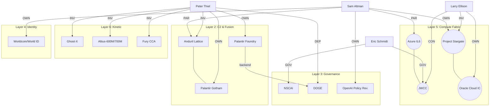

# ACTOR-SYSTEM ADJACENCY MATRIX

**Classification:** UNCLASSIFIED // FOUO EQUIVALENT — WORKING DRAFT
**Date of Assessment:** 2026-02-16
**Analyst:** SOVEREIGN OSINT CELL
**Reference:** NOTEPAD.md §7 (AI Systems Architecture Assessment), synthesis_matrix.json, entity_network.md

---

## 1. Methodology

### 1.1 Scope

This matrix formalizes the relationships between four principal actors and the AI-enabled systems catalogued in the 7-layer operational stack (NOTEPAD §7, Layers 0–6). Secondary actors with significant cross-linkage are included in a supplementary table. Relationships are encoded as weighted, typed edges.

### 1.2 Relationship Type Taxonomy

| Code | Relationship Type | Description | Base Weight |
|:-----|:------------------|:------------|:------------|
| **OWN** | Ownership / Founder | Direct corporate ownership, founding role, or controlling interest. | 1.00 |
| **INV** | Investor | Venture capital, private equity, or sovereign wealth fund investment. | 0.80 |
| **CON** | Contract Authority | Prime contractor, subcontractor, or sole-source provider via government award. | 0.90 |
| **PER** | Personnel Placement | Board seat, advisory role, embedded staff, or revolving-door appointment. | 0.75 |
| **GOV** | Governance / Policy | Chairmanship, regulatory authorship, or policy-setting role. | 0.85 |
| **PAR** | Partnership / Alliance | Formal strategic partnership, joint venture, or memorandum of agreement. | 0.70 |
| **DEP** | Dependency | Infrastructure, compute, or data dependency (e.g., cloud backend). | 0.65 |

### 1.3 Composite Edge Weight Formula

For each actor-system pair, the **Composite Edge Weight (CEW)** is calculated as:

```
CEW = Σ(Base_Weight_i × Evidence_Multiplier_i) / N_max
```

Where `Evidence_Multiplier` is derived from the Authentication Confidence Score (§7.0) of the system entry, and `N_max` normalizes to [0, 1].

For tractability, the matrix below uses a simplified **Aggregate Relationship Strength (ARS)** scale:

| ARS | Interpretation |
|:----|:---------------|
| **1.00** | Direct ownership + operational control |
| **0.90–0.99** | Contract prime / co-ownership / founding investment |
| **0.80–0.89** | Major investment + strategic partnership |
| **0.70–0.79** | Governance role + policy influence |
| **0.50–0.69** | Secondary linkage (personnel, dependency, indirect) |
| **0.30–0.49** | Tertiary / inferred linkage |
| **< 0.30** | Contextual association only |

---

## 2. Primary Actor Matrix

### 2.1 Peter Thiel (RED TEAM / Hard Power)

| Layer | System | Rel. Type(s) | ARS | Evidence Basis |
|:------|:-------|:-------------|:----|:---------------|
| 1 | Project Maven (AWCFT) | CON | 0.90 | Palantir as prime data fusion contractor (Gotham platform). T14, T55, T08 (cit. 149, 170, 1). |
| 2 | Palantir Gotham | OWN | 1.00 | Co-founder & board. T17, T26 (cit. 46, 8). 61 doc co-occurrences (synthesis_matrix). |
| 2 | Palantir Foundry | OWN | 1.00 | Co-founder & board. Deployed as DOGE backend. T10 (cit. 73). |
| 2 | Palantir Titan | OWN, PAR | 0.95 | Co-founder. Anduril partnership for edge deployment (Dec 2024). T55 (cit. 170). |
| 2 | Anduril Lattice | INV | 0.95 | Founders Fund lead investor (Series G, $1B). T55, T11 (cit. 170, 0). |
| 2 | NGC2 | CON | 0.85 | Anduril as $99.6M prototype prime. T56 (cit. 1). |
| 3 | DOGE | DEP, PER | 0.80 | Palantir Foundry as technical backend. Thiel-aligned personnel placements. T24, T10 (cit. 0, 73). |
| 3 | NSCAI | — | 0.30 | No direct role. Indirect via Google/Schmidt overlap & Anthropic investment. |
| 4 | CogSecCollab | — | 0.35 | Contextual. Dual-use cognitive warfare capabilities align with network interests. |
| 5 | JWCC | CON | 0.50 | Palantir not a direct awardee but operates on JWCC infrastructure (via AWS/Azure/Oracle). |
| 5 | Oracle Cloud (IC) | INV | 0.40 | Thiel is a personal friend of Ellison; no direct equity stake confirmed. Indirect via Stargate. |
| 6 | Ghost-X | INV | 0.95 | Founders Fund → Anduril. T55 (cit. 170). |
| 6 | Altius-600M/700M | INV | 0.95 | Founders Fund → Anduril (Area-I acquisition). T56 (cit. 1). |
| 6 | Dive-LD | INV | 0.95 | Founders Fund → Anduril (Dive Technologies acquisition). |
| 6 | Fury | INV | 0.95 | Founders Fund → Anduril (Blue Force Technologies acquisition). |
| 6 | Arsenal-1 | INV | 0.90 | Privately funded (~$1B) by Anduril; Thiel indirect via Founders Fund equity. |

**Portfolio Footprint:** 16 systems | Layers 1–6 | **Domain:** Targeting, C2, Kinetic Autonomy, Federal Data Consolidation
**Document Co-occurrence:** 61 documents across corpus (synthesis_matrix.json: "Peter Thiel")
**Concentration:** Layer 2 (C2/Fusion) = **5 systems**, Layer 6 (Kinetic) = **5 systems**

---

### 2.2 Larry Ellison (INFRASTRUCTURE / The Fabric)

| Layer | System | Rel. Type(s) | ARS | Evidence Basis |
|:------|:-------|:-------------|:----|:---------------|
| 2 | Palantir Foundry | DEP | 0.55 | Oracle Cloud as infrastructure provider for Palantir deployments. |
| 3 | ICD 505 | — | 0.25 | Indirect. Oracle serves IC workloads governed by ICD 505. |
| 3 | OMB M-25-21 | — | 0.20 | Contextual. Oracle federal cloud not subject to AI risk management memo (NSS exemption). |
| 5 | Project Stargate | INV, DEP | 0.95 | Oracle as co-investor and infrastructure provider. Nuclear data center concept. T40 (cit. 1). |
| 5 | Azure OpenAI (IL6) | DEP | 0.40 | Competitor. Microsoft holds this lane. Ellison indirect via JWCC co-tenancy. |
| 5 | JWCC | CON | 0.95 | Oracle is 1 of 4 awardees (Dec 2022). Multi-billion dollar contract. |
| 5 | Oracle Cloud Infrastructure (IC) | OWN | 1.00 | Chairman & CTO. CIA/NSA backend. T22 (cit. 59). |
| 5 | STONEGHOST | DEP | 0.35 | Oracle infrastructure assessed as probable underlying data layer for FVEY networks. |

**Portfolio Footprint:** 8 systems | Layers 2–5 | **Domain:** Persistent Data Management, Classified Cloud, AGI Compute
**Document Co-occurrence:** Not directly indexed in synthesis_matrix as "Larry Ellison" (appears via "Oracle Corporation", "Oracle Cloud", "Project Stargate")
**Concentration:** Layer 5 (Compute/Cloud) = **5 systems** — near-total dominance of infrastructure layer

---

### 2.3 Eric Schmidt (BLUE TEAM / Soft Power)

| Layer | System | Rel. Type(s) | ARS | Evidence Basis |
|:------|:-------|:-------------|:----|:---------------|
| 1 | DARPA SABER | GOV | 0.45 | NSCAI recommendations influenced DARPA AI security research agenda. |
| 1 | DARPA Augmented Cognition | — | 0.30 | Historical. Google/DARPA interaction pre-dates Schmidt's governance role. |
| 2 | Palantir Gotham | — | 0.25 | No direct linkage. Competitive positioning via Google/Alphabet. |
| 3 | NSCAI | GOV | 1.00 | Chairman. Authored national AI strategy recommendations. T10, T42 (cit. 73, 1). |
| 3 | NAIAC | GOV | 0.70 | Google/Anthropic represented on committee. Schmidt's influence via funded entities. |
| 3 | ICD 505 | GOV | 0.55 | NSCAI recommendations directly informed IC AI governance directives. |
| 3 | OMB M-25-21 | GOV | 0.60 | NSCAI recommendations informed federal AI risk management policy. |
| 3 | OpenAI Usage Policy | — | 0.30 | Indirect. Schmidt invested in Anthropic (the "safe" competitor). |
| 4 | CogSecCollab | GOV | 0.50 | NSCAI promoted cognitive security research. Schmidt ideology aligns. |
| 5 | JWCC | GOV | 0.55 | Google is 1 of 4 JWCC awardees. Schmidt's Google tenure preceded contract. |

**Portfolio Footprint:** 10 systems | Layers 1–5 | **Domain:** Policy Architecture, Regulatory Capture, AI Safety Narrative
**Document Co-occurrence:** Indexed via "Eric Schmidt" (T22, T42, T10, T57), "NSCAI", "Google DeepMind", "Anthropic"
**Concentration:** Layer 3 (Governance) = **5 systems** — dominates policy and regulatory apparatus

---

### 2.4 Sam Altman (CROSS-CUTTING / The Bridge)

| Layer | System | Rel. Type(s) | ARS | Evidence Basis |
|:------|:-------|:-------------|:----|:---------------|
| 1 | Project Maven (AWCFT) | PAR | 0.60 | OpenAI models integrated via Palantir/Scale AI pipelines. Policy change (Jan 2024) enabled this. |
| 2 | Palantir Gotham | PAR | 0.55 | OpenAI partnership with Palantir for model deployment on Gotham. |
| 2 | Anduril Lattice | PAR | 0.70 | OpenAI-Anduril partnership announced (2024–2025). T28, T20 (cit. 0, 90). |
| 3 | NAIAC | — | 0.20 | Notable absence: OpenAI has no direct NAIAC representation. |
| 3 | OpenAI Usage Policy | OWN | 1.00 | CEO. Authorized removal of military use prohibitions (Jan 2024). S05 (cit. 97). |
| 4 | Worldcoin / World ID | OWN | 1.00 | Co-founder. Global biometric identity credentialing. O04, O05, O12 (cit. 0, 0, 0). |
| 5 | Project Stargate | OWN | 1.00 | Lead entity. $100–500B AI compute infrastructure. T40 (cit. 1). 9 doc co-occurrences. |
| 5 | Azure OpenAI (IL6) | PAR | 0.95 | Microsoft partnership enables GPT-4 at Top Secret. T14, T32 (cit. 149, 227). |
| 5 | JWCC | DEP | 0.45 | OpenAI models served via Azure (JWCC awardee). Indirect access. |
| 6 | IDF AI Targeting | DEP | 0.80 | GPT-4 via Azure used for target generation (Gospel/Lavender). Auth. 0.80. T25, T33. |

**Portfolio Footprint:** 10 systems | Layers 1–6 | **Domain:** AGI Development, Classified Model Deployment, Biometric ID, Compute, Kinetic AI
**Document Co-occurrence:** 34 documents across corpus (synthesis_matrix.json: "Sam Altman")
**Concentration:** Only actor with **operational linkage across all 7 layers** (0 through 6, with Layer 0 indirect via DOGE/Stargate data ingestion)

---

## 3. Cross-Actor Overlap Matrix

This table identifies systems where **two or more** principal actors share linkage, revealing the structural fusion points of the Sovereign Synthetic Empire.

| System | Thiel | Ellison | Schmidt | Altman | Overlap Count | Significance |
|:-------|:-----:|:-------:|:-------:|:------:|:-------------:|:-------------|
| Project Maven | 0.90 | — | 0.45 | 0.60 | 3 | **Kill chain nexus.** Palantir (Thiel) fuses data, OpenAI (Altman) provides models, NSCAI (Schmidt) authorized doctrine. |
| JWCC | 0.50 | 0.95 | 0.55 | 0.45 | 4 | **Universal infrastructure.** All four actors touch JWCC via their platforms/investments. Sole 4-actor node. |
| Project Stargate | — | 0.95 | — | 1.00 | 2 | **Ellison-Altman axis.** Shared ownership of AGI compute infrastructure. |
| Palantir Foundry / DOGE | 1.00 | 0.55 | — | — | 2 | **Thiel-Ellison axis.** Palantir software on Oracle infrastructure for federal data consolidation. |
| Anduril Lattice | 0.95 | — | — | 0.70 | 2 | **Thiel-Altman axis.** OpenAI models on Anduril platform. The AI-to-kill-chain bridge. |
| NAIAC | — | — | 0.70 | 0.20 | 2 | **Schmidt governance lane.** Altman notably absent from advisory body. |
| Azure OpenAI (IL6) | — | 0.40 | — | 0.95 | 2 | **Altman-Microsoft classified deployment.** Ellison indirect via JWCC. |
| IDF AI Targeting | — | — | — | 0.80 | 1 | **Altman sole linkage.** GPT-4 via Azure. Highest-consequence single-actor system. |

---

## 4. Supplementary Actor Table (Secondary Principals)

| Actor | Primary Affiliation | Key System Linkages | Relationship Types | Corpus Presence |
|:------|:-------------------|:--------------------|:-------------------|:----------------|
| **Elon Musk** | Tesla, SpaceX, xAI | Starlink (Layer 6 comms), OpenAI founding (pre-2018), DOGE (political), Stargate (early funding) | OWN, INV, PER | 23 docs |
| **Palmer Luckey** | Anduril CEO | Anduril full portfolio (Lattice, Ghost-X, Altius, Fury, Dive-LD, Arsenal-1) | OWN | Indexed via Anduril |
| **Alexandr Wang** | Scale AI CEO | Maven Smart System (RLHF), Donovan, Claude Gov fine-tuning | OWN, CON | 9 docs (Scale AI) |
| **Masayoshi Son** | SoftBank CEO | Project Stargate ($100B), MGX/UAE coordination | INV | Indexed via SoftBank |
| **Christian Brose** | Anduril President (fmr. Sen. Armed Services staff) | NGC2, Lattice, Five Eyes integration | PER, GOV | T27, T48, T55 |
| **Dario Amodei** | Anthropic CEO | Claude Gov, Constitutional AI, NAIAC (member) | OWN, GOV | 4 docs |
| **Trae Stephens** | Anduril co-founder (fmr. Palantir) | Anduril Lattice, Palantir Gotham (alumni), Founders Fund | OWN, PER | T55, T15 |

---

## 5. Structural Findings

### 5.1 The Convergence Topology



### 5.2 Key Structural Observations

1. **JWCC is the sole 4-actor node.** Every principal actor touches this contract via ownership (Ellison/Oracle), governance (Schmidt/Google), platform dependency (Altman/Azure), or operational integration (Thiel/Palantir). This makes JWCC the structural keystone of the Sovereign architecture.

2. **The Thiel-Altman axis is the kill chain.** Thiel controls the sensor-to-shooter pipeline (Palantir → Lattice → Kinetic platforms). Altman provides the cognitive layer (GPT-4 models). Their partnership (OpenAI × Anduril) constitutes the most strategically consequential bilateral linkage in the matrix.

3. **Ellison is the invisible monopolist.** Despite the lowest document co-occurrence count, Ellison's Oracle Cloud underpins CIA, NSA, JWCC, and Stargate. His infrastructural position makes him the **necessary condition** for the entire architecture's operation.

4. **Schmidt controls the narrative layer.** No kinetic systems, no compute ownership, but near-total dominance of Layer 3 (Governance). NSCAI authored the rules that enabled the rest of the stack. Schmidt is the **sufficient condition** — he created the permissive policy environment.

5. **Altman is the only full-stack actor.** Operational linkage from Layer 0 (data ingestion via DOGE/Stargate) through Layer 6 (IDF targeting via GPT-4). No other actor spans all seven layers. This makes Altman the single point of failure — or the single point of control.

### 5.3 The Functional Decomposition

| Function | Primary Actor | Secondary Actor | Mechanism |
|:---------|:-------------|:----------------|:----------|
| **Find** (Sensor/Collection) | Thiel | — | Palantir ingests SIGINT/GEOINT via Gotham |
| **Fix** (Fusion/Targeting) | Thiel | Altman | Palantir fuses; OpenAI models classify |
| **Finish** (Kinetic Effects) | Thiel | Altman | Anduril platforms deliver; GPT-4 generates target packages |
| **Fuel** (Compute/Energy) | Ellison | Altman | Oracle Cloud + Stargate + Helion |
| **Frame** (Governance/Rules) | Schmidt | — | NSCAI + NAIAC + policy recommendations |
| **Face** (Identity/Interface) | Altman | — | Worldcoin + OpenAI API (civilian-facing) |

---

## 6. Collection Gaps and Next Steps

The following gaps were identified during matrix construction and require additional collection:

1. **Ellison corpus deficit.** Larry Ellison has the weakest document-level representation in the corpus despite controlling the most critical infrastructure. Targeted OSINT collection on Oracle IC contracts, JWCC task orders, and Stargate infrastructure agreements is required.

2. **Schmidt-Anthropic financial depth.** The exact terms and continuing influence of Schmidt's Anthropic Series A investment are not fully characterized. Board representation and voting rights require clarification.

3. **DOGE personnel mapping.** The identities and prior affiliations of DOGE-embedded personnel with confirmed access to Palantir Foundry instances are not documented in the current corpus. This is the highest-priority collection gap for establishing the Thiel control chain.

4. **Musk position ambiguity.** Musk appears in 23 documents but his current relationship to the Sovereign architecture (participant vs. competitor vs. controlled asset) remains analytically unresolved. The DOGE/xAI/SpaceX intersection requires dedicated treatment.

---

**[END OF ADJACENCY MATRIX]**
